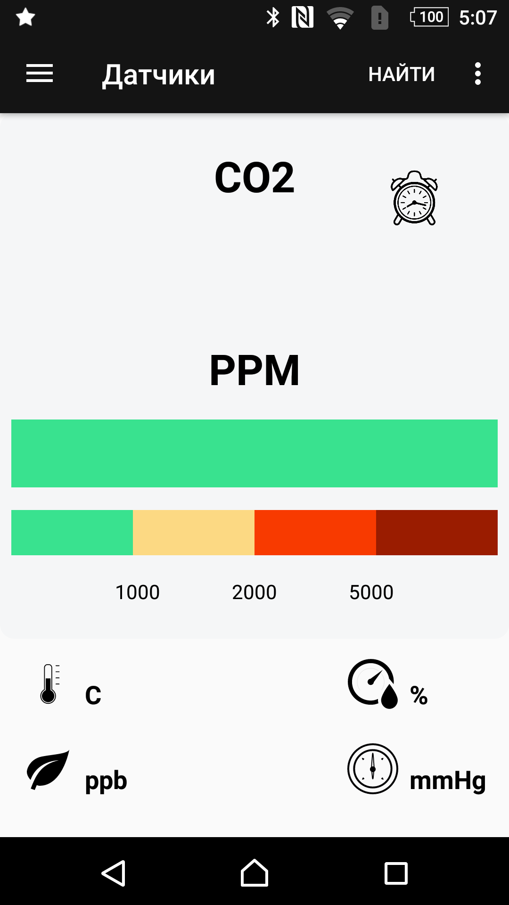

# Sensors Application

The app shows an example of integration with the Nordic Thingy: 52 ™ devices.

Nordic Thingy:52 is a compact, power-optimized, multi-sensor device built around the nRF52832 Bluetooth® 5 SoC from Nordic Semiconductor.

###For firmware and mobile developers:
Thingy can be flashed with custom firmware, just like any other development kit from Nordic Semiconductor. 

